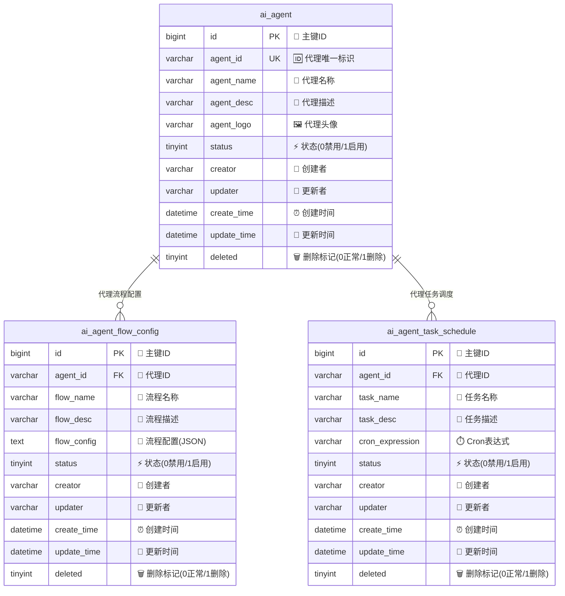
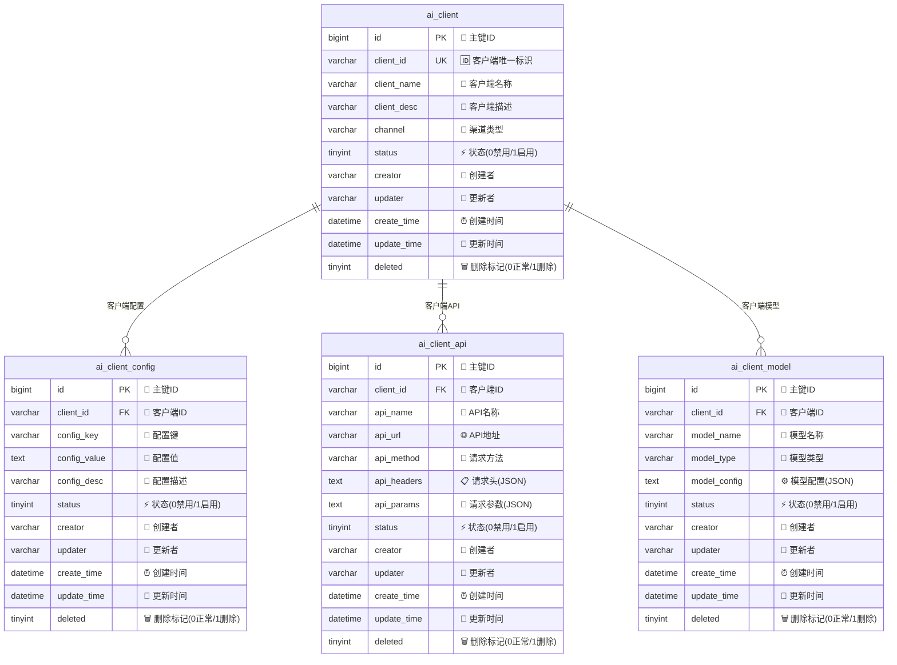
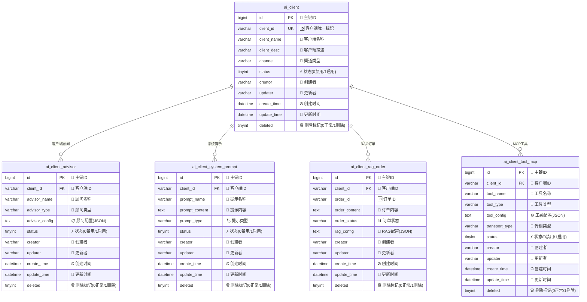

# 🤖 AI Agent Station 数据库 ER 图 (Mermaid)

## 🤖 AI Agent 部分

## 🤖 AI Client 部分01

## 🤖 AI Client 部分02

# 整体架构

```mermaid
erDiagram 

    %% AI代理相关表
    ai_agent {
        bigint id PK "🔑 主键ID"
        varchar agent_id UK "🆔 代理唯一标识"
        varchar agent_name "📝 代理名称"
        varchar agent_desc "📄 代理描述"
        varchar agent_logo "🖼️ 代理头像"
        tinyint status "⚡ 状态(0禁用/1启用)"
        varchar creator "👤 创建者"
        varchar updater "🔄 更新者"
        datetime create_time "⏰ 创建时间"
        datetime update_time "🔄 更新时间"
        tinyint deleted "🗑️ 删除标记(0正常/1删除)"
    }

    ai_agent_flow_config {
        bigint id PK "🔑 主键ID"
        varchar agent_id FK "🔗 代理ID"
        varchar flow_name "📝 流程名称"
        varchar flow_desc "📄 流程描述"
        text flow_config "🔧 流程配置(JSON)"
        tinyint status "⚡ 状态(0禁用/1启用)"
        varchar creator "👤 创建者"
        varchar updater "🔄 更新者"
        datetime create_time "⏰ 创建时间"
        datetime update_time "🔄 更新时间"
        tinyint deleted "🗑️ 删除标记(0正常/1删除)"
    }

    ai_agent_task_schedule {
        bigint id PK "🔑 主键ID"
        varchar agent_id FK "🔗 代理ID"
        varchar task_name "📝 任务名称"
        varchar task_desc "📄 任务描述"
        varchar cron_expression "⏱️ Cron表达式"
        tinyint status "⚡ 状态(0禁用/1启用)"
        varchar creator "👤 创建者"
        varchar updater "🔄 更新者"
        datetime create_time "⏰ 创建时间"
        datetime update_time "🔄 更新时间"
        tinyint deleted "🗑️ 删除标记(0正常/1删除)"
    }
    
    %% AI客户端相关表
    ai_client {
        bigint id PK "🔑 主键ID"
        varchar client_id UK "🆔 客户端唯一标识"
        varchar client_name "📝 客户端名称"
        varchar client_desc "📄 客户端描述"
        varchar channel "📡 渠道类型"
        tinyint status "⚡ 状态(0禁用/1启用)"
        varchar creator "👤 创建者"
        varchar updater "🔄 更新者"
        datetime create_time "⏰ 创建时间"
        datetime update_time "🔄 更新时间"
        tinyint deleted "🗑️ 删除标记(0正常/1删除)"
    }
    
    ai_client_config {
        bigint id PK "🔑 主键ID"
        varchar client_id FK "🔗 客户端ID"
        varchar config_key "🔑 配置键"
        text config_value "💾 配置值"
        varchar config_desc "📄 配置描述"
        tinyint status "⚡ 状态(0禁用/1启用)"
        varchar creator "👤 创建者"
        varchar updater "🔄 更新者"
        datetime create_time "⏰ 创建时间"
        datetime update_time "🔄 更新时间"
        tinyint deleted "🗑️ 删除标记(0正常/1删除)"
    }
    
    ai_client_api {
        bigint id PK "🔑 主键ID"
        varchar client_id FK "🔗 客户端ID"
        varchar api_name "📝 API名称"
        varchar api_url "🌐 API地址"
        varchar api_method "🔧 请求方法"
        text api_headers "📋 请求头(JSON)"
        text api_params "📝 请求参数(JSON)"
        tinyint status "⚡ 状态(0禁用/1启用)"
        varchar creator "👤 创建者"
        varchar updater "🔄 更新者"
        datetime create_time "⏰ 创建时间"
        datetime update_time "🔄 更新时间"
        tinyint deleted "🗑️ 删除标记(0正常/1删除)"
    }
    
    ai_client_model {
        bigint id PK "🔑 主键ID"
        varchar client_id FK "🔗 客户端ID"
        varchar model_name "📝 模型名称"
        varchar model_type "🤖 模型类型"
        text model_config "⚙️ 模型配置(JSON)"
        tinyint status "⚡ 状态(0禁用/1启用)"
        varchar creator "👤 创建者"
        varchar updater "🔄 更新者"
        datetime create_time "⏰ 创建时间"
        datetime update_time "🔄 更新时间"
        tinyint deleted "🗑️ 删除标记(0正常/1删除)"
    }
    
    ai_client_advisor {
        bigint id PK "🔑 主键ID"
        varchar client_id FK "🔗 客户端ID"
        varchar advisor_name "📝 顾问名称"
        varchar advisor_type "👔 顾问类型"
        text advisor_config "📋 顾问配置(JSON)"
        tinyint status "⚡ 状态(0禁用/1启用)"
        varchar creator "👤 创建者"
        varchar updater "🔄 更新者"
        datetime create_time "⏰ 创建时间"
        datetime update_time "🔄 更新时间"
        tinyint deleted "🗑️ 删除标记(0正常/1删除)"
    }
    
    ai_client_system_prompt {
        bigint id PK "🔑 主键ID"
        varchar client_id FK "🔗 客户端ID"
        varchar prompt_name "📝 提示名称"
        text prompt_content "💭 提示内容"
        varchar prompt_type "🏷️ 提示类型"
        tinyint status "⚡ 状态(0禁用/1启用)"
        varchar creator "👤 创建者"
        varchar updater "🔄 更新者"
        datetime create_time "⏰ 创建时间"
        datetime update_time "🔄 更新时间"
        tinyint deleted "🗑️ 删除标记(0正常/1删除)"
    }
    
    ai_client_rag_order {
        bigint id PK "🔑 主键ID"
        varchar client_id FK "🔗 客户端ID"
        varchar order_id "🆔 订单ID"
        text order_content "📄 订单内容"
        varchar order_status "📊 订单状态"
        text rag_config "🔧 RAG配置(JSON)"
        varchar creator "👤 创建者"
        varchar updater "🔄 更新者"
        datetime create_time "⏰ 创建时间"
        datetime update_time "🔄 更新时间"
        tinyint deleted "🗑️ 删除标记(0正常/1删除)"
    }
    
    ai_client_tool_mcp {
        bigint id PK "🔑 主键ID"
        varchar client_id FK "🔗 客户端ID"
        varchar tool_name "📝 工具名称"
        varchar tool_type "🔧 工具类型"
        text tool_config "⚙️ 工具配置(JSON)"
        varchar transport_type "🚚 传输类型"
        tinyint status "⚡ 状态(0禁用/1启用)"
        varchar creator "👤 创建者"
        varchar updater "🔄 更新者"
        datetime create_time "⏰ 创建时间"
        datetime update_time "🔄 更新时间"
        tinyint deleted "🗑️ 删除标记(0正常/1删除)"
    }
    
    %% 第二行：AI客户端核心关系
    ai_client ||--o{ ai_client_config : "客户端配置"
    ai_client ||--o{ ai_client_api : "客户端API"
    ai_client ||--o{ ai_client_model : "客户端模型"
    ai_client ||--o{ ai_client_advisor : "客户端顾问"
    ai_client ||--o{ ai_client_system_prompt : "系统提示"
    ai_client ||--o{ ai_client_rag_order : "RAG订单"
    ai_client ||--o{ ai_client_tool_mcp : "MCP工具"

    %% ===========================================
    %% 表关系定义 (分层布局)
    %% ===========================================
    
    %% 第一行：AI代理模块关系
    ai_agent ||--o{ ai_agent_flow_config : "代理流程配置"
    ai_agent ||--o{ ai_agent_task_schedule : "代理任务调度"
```

## 📊 数据库设计说明

### 🏗️ 架构特点
- **🔑 统一主键设计**: 所有表都使用 `bigint` 类型的自增主键
- **🗑️ 软删除机制**: 通过 `deleted` 字段实现软删除(0正常/1删除)
- **👤 操作人员追踪**: 记录 `creator` 和 `updater` 信息
- **⏰ 完整时间戳**: 包含 `create_time` 和 `update_time`
- **📊 统一状态管理**: 使用 `status` 字段(0禁用/1启用)
- **🔧 JSON配置存储**: 复杂配置信息使用 `text` 类型存储JSON

### 🔗 关系说明
- **AI代理模块**: `ai_agent` 作为核心表，关联流程配置和任务调度
- **AI客户端模块**: `ai_client` 作为核心表，关联各种配置和功能模块
- **一对多关系**: 核心表与配置表之间均为一对多关系

### 🎯 使用场景
- **🤖 AI代理管理**: 创建和管理不同的AI代理实例
- **⚙️ 流程配置**: 为每个代理配置不同的工作流程
- **⏰ 任务调度**: 设置定时任务和调度规则
- **💻 客户端管理**: 管理不同渠道的客户端接入
- **🔧 配置管理**: 灵活的配置项管理
- **🌐 API集成**: 外部API的集成和管理
- **🧠 模型管理**: AI模型的配置和切换
- **👨‍💼 顾问系统**: 智能顾问功能配置
- **💬 提示管理**: 系统提示词的管理
- **📚 RAG功能**: 检索增强生成的订单管理
- **🛠️ MCP工具**: 模型控制协议工具集成

## 🚀 如何使用

### 📝 PlantUML 格式
- 文件: `er-diagram.puml`
- 可以使用 PlantUML 工具生成 PNG、SVG、PDF 等格式
- 支持在线渲染: http://www.plantuml.com/plantuml/

### 🌊 Mermaid 格式
- 文件: `er-diagram.md`
- 可以在 GitHub、GitLab、Notion 等平台直接渲染
- 支持在线编辑: https://mermaid.live/

### 🎨 SVG 格式
- 文件: `er-diagram.svg`
- 矢量图形，可无限缩放
- 直接在浏览器中查看